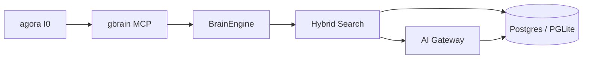

# gbrain — Architecture

> **Layer**: L2 引擎面  
> **Role**: TypeScript 知识数据库 / Postgres 混合 RAG / 知识图谱  
> **Stack**: TypeScript, Bun, Postgres 17 + pgvector, PGLite WASM  
> **Health**: See local CI and runtime probes
> **SSOT**: 运行时健康、测试规模、MCP 能力计数以本项目 CI、本地探针和 workspace governance SSOT 为准
>
> 系统全景参见：[`docs/ARCHITECTURE-DIAGRAM.md`](../docs/ARCHITECTURE-DIAGRAM.md)

---

## 1. 内部架构



## 2. 入口

| Type | Entry | Port / Notes |
|:--|:--|:--|
| CLI | `gbrain` | src/cli.ts |
| MCP stdio | `gbrain serve` | src/mcp/server.ts |
| MCP HTTP | `gbrain serve --http` | OAuth 2.1 |

## 3. 核心模块

| Module | Responsibility |
|:--|:--|
| `src/core/engine.ts` | BrainEngine contract (~67 ops) |
| `src/core/operations.ts` | Operation definitions + trust boundary |
| `src/core/search/hybrid.ts` | Hybrid vector + keyword + RRF retrieval |
| `src/core/ai/gateway.ts` | Unified AI chat/embed/rerank seam |
| `src/mcp/server.ts` | MCP server dispatch |
| `src/cli.ts` | CLI entry |

## 4. 测试

```bash
cd projects/gbrain && bun test
```
