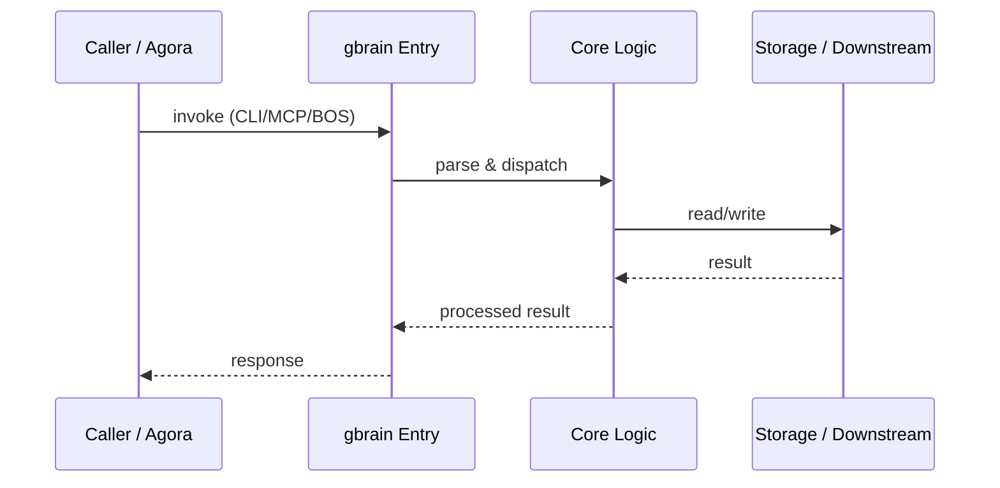

# gbrain — Call Chain

> 本文档描述 gbrain 内部最核心的一条调用链 / 数据流。
>
> 通用跨层调用链参见：[`../../docs/I0-AGORA-CALLCHAIN.md`](../../docs/I0-AGORA-CALLCHAIN.md)

---

## 关键路径

1. 1. Caller invokes `bos://memory/gbrain/search` via agora
2. 2. gbrain MCP server receives operation via `src/mcp/server.ts`
3. 3. `BrainEngine` resolves brain + source, builds `OperationContext`
4. 4. `hybrid.ts` executes vector + keyword + RRF retrieval
5. 5. AI gateway reranks and enriches results
6. 6. Results returned through MCP response → agora → caller

## Sequence Diagram

